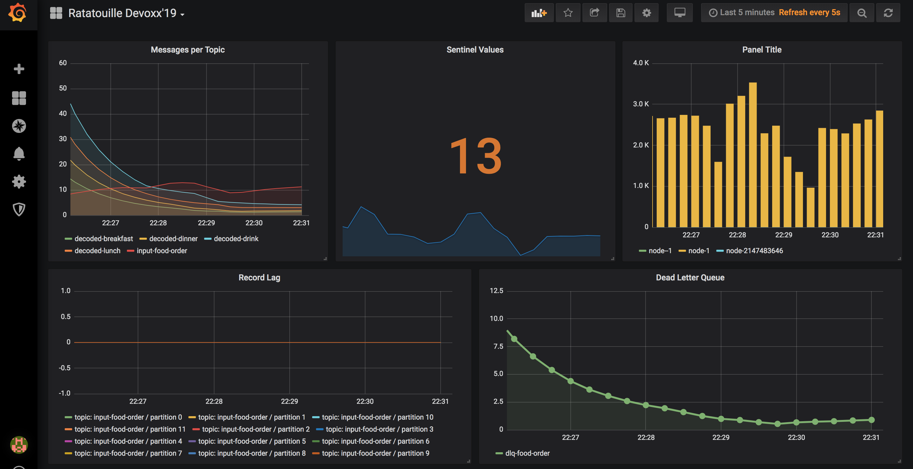

# XKE Ratatouille: Streaming App and Poison Pills 

This module illustrates the concept of *poison pill 💊* for streaming applications and shows how to face this issue with 
[Kafka Streams](https://kafka.apache.org/documentation/streams/), a client library for building continuous processing 
applications with Apache Kafka.  

> You might experience that some of the incoming records from your Kafka Streams application are corrupted, 
or that the **serializer**/**deserializer** might be incorrect or buggy, or cannot handle all record types. 
These types of records are referred to as “*poison pills*”.
-- _[Confluent FAQ](https://docs.confluent.io/current/streams/faq.html#failure-and-exception-handling)_  

## tl;dr

The module is also the support for a few talks, here are the two major ones:
- [Devoxx France 2019: Comment Kafka Streams compte faire passer la pillule_🇫🇷](https://blog.loicmdivad.com/talks/kafka-streams-poison-pills-devoxx-france19/)
- [Kafka Summit San Francisco 2019: handle the unexpected with Kafka Streams](https://blog.loicmdivad.com/talks/kafka-streams-poison-pills-kafka-summit-sf19/)

## Table of contents

- [Storytelling](#Storytelling)
- [Run the full demo](#Run-the-full-demo)
  - [Setup](#Setup)
  - [Sentinel Value](#Sentinel-Value)
  - [Dead Letter Queue](#Dead-Letter-Queue)
  - [Clean up](#Clean-up)
- [Complete the exercises](#) TODO

## Perquisite

- [hexdump](http://man7.org/linux/man-pages/man1/hexdump.1.html) 
- [Docker](https://www.docker.com/)
- [jdk](https://openjdk.java.net/) >= 1.8

## Storytelling

Really old systems receive raw bytes directly from message queues. With Kafka (Connect and Streams) we’d like to 
continuously transform these messages. But we need a deserializer with special decoder to understand each event.
What happens if we get a buggy implementation of the deserializer?

## Run the full demo

### Setup
Checkout the master branch and open 3 terminals, and start docker.

```{bash}
$ git clone https://github.com/DivLoic/xke-ratatouille.git
$ cd xke-ratatouille
```

Run the `gradlew-compose` script. This will, compile the project, create docker images and run them.

```{bash}
$ ./gradlew-compose.sh

# expected output
#
#        Name                      Command               State                       Ports
# -------------------------------------------------------------------------------------------------------------
# elasticsearch         /usr/local/bin/docker-entr ...   Up      0.0.0.0:9200->9200/tcp, 9300/tcp
# grafana               /run.sh                          Up      0.0.0.0:3000->3000/tcp
# kafka                 /etc/confluent/docker/run        Up      0.0.0.0:9092->9092/tcp, 0.0.0.0:9094->9094/tcp
# kafka-connect         /etc/confluent/docker/run        Up      0.0.0.0:8083->8083/tcp, 9092/tcp
# kibana                /usr/local/bin/kibana-docker     Up      0.0.0.0:5601->5601/tcp
# prometheus            /bin/prometheus --config.f ...   Up      0.0.0.0:9090->9090/tcp
# ratatouille-app       /bin/sh -c http-server .         Up      0.0.0.0:8080->8080/tcp
# ratatouille-datagen   /opt/ratatouille-datagen/b ...   Up      0.0.0.0:7070->7070/tcp
# schema-registry       /etc/confluent/docker/run        Up      0.0.0.0:8081->8081/tcp
``` 

In a new terminal, run the consumer script.

```${bash}
$ ./consume-input.sh
```

Open a web browser at the address: [http://localhost:8080](http://localhost:8080/app/index.html).   
An interface with four toggles lets you generate records. Among theses records some are corrupted,
that's the *poison pills 💊* specially introduced by the generator.  

  

In a new terminal, start the streaming app.

```${bash}
$ ./gradlew demo
```
[](https://asciinema.org/a/xEhjhc5JomMpnXqLEtV1SslZ1)

Since it's the correction, this version take care of all the corrupted messages.

### Sentinel Value
Go on [http://localhost:3000/d/YmOgiAgWk/](http://localhost:3000/d/YmOgiAgWk/ratatouille-devoxx19?orgId=1&refresh=5s)
(admin/admin🤫). You should see, in the middle of a dashboard, the number of corrupted elements.

  

Switch off the exercise 3 to see the number off *Sentinel Value* decrease.   
Culprit spoted🎉! Some drinks are not serialised as expected. Actually this is the case for all the wines.    

### Dead Letter Queue
Scroll down the interface and switch on the Elasticsearch connector. This connector send messages from the 
`dlq-food-error` topic to a Elasticsearch index. Then you can visualise them in Kibana. 
  

All corrupted messages in dinner flow end with `414554`. 
```{text}
414554 -> AET -> Australia/Sydney
```
Culprit spoted🎉! Corrupted messages are sent by a brand new restaurant in Australia.  

### Clean up
Stop all your running commands (`Ctrl+C`). Stop and destroy all containers:

```
$ docker-compose down
```

## Complete the exercises

_TODO_
